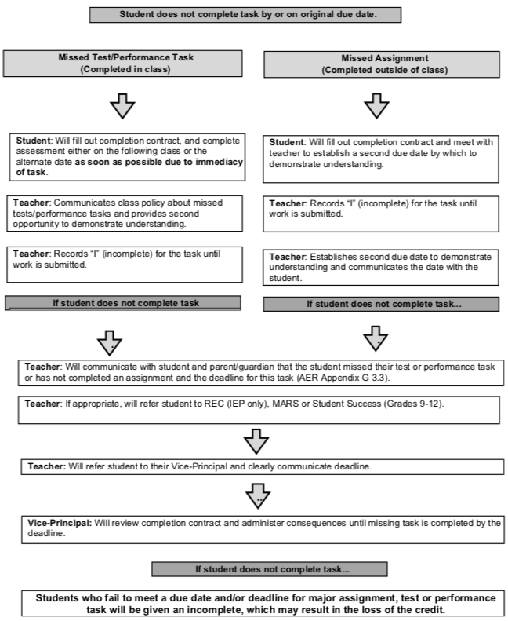

## Assessment

### Essential Learnings

You will be evaluated in the following four essential learnings:

* **Project Management:** Apply project management techniques in student-managed projects.
* **Programming Skills:** Create, test, and troubleshoot modular computer programs.
* **Programming Concepts:** Design and analyze complex algorithms and computer programs.
* **Digital Scholar:** Investigate ethical, environmental, and emerging technology topics.

### Final Grade

Your final grade will be determined as follows (in accordance with Ministry of Education standards).

* 70% Term Work – Based on evaluations conducted throughout the course.
* 30% Summative Evaluation – A final evaluation in the form of a group project.

Unless otherwise indicated, all assignments will be submitted using the dropbox for that assignment.

### Assignment Submission

All assignments are expected to be submitted by the due date noted in their respective activity pages. You must submit the assignments through the virtual classroom on Google Classroom or repl.it. If you feel that you don't have enough time to finish an activity before its due date, please contact me so we can sort it out.

### Viewing Grades and Feedback

After an assignment is graded, you can view your grade for it along with complementary feedback. 

### Learning Skills

The following Learning Skills descriptions will be used to help assess Learning Skills.

_Responsibility_

* Fulfills responsibilities and commitments within the classroom environment.
* Completes and submits class work, homework and assignments according to agreed-upon timelines.
* Takes responsibility for and manages own behaviour.

_Organization_

* Devises and follows a plan and process for completing work and tasks.
* Establishes priorities and manages time to complete tasks and achieve goals.
* Identifies, gathers, evaluates and uses information, technology and resources to complete tasks.

_Independent Work_

* Independently monitors, assesses, and revises plans to complete tasks and meet goals.
* Uses class time appropriately to complete tasks.
* Follows instructions with minimal supervision.

_Collaboration_

* Accepts various roles and an equitable share of work in a group.
* Responds positively to the ideas, opinions, values, and traditions of others.
* Builds healthy peer-to-peer relationships through personal and media assisted interactions.
* Works with others to resolve conflicts and build consensus to achieve group goals.
* Shares information, resources, and expertise and promotes critical thinking to solve problems and makes decisions.

_Initiative_

* Looks for and acts on new ideas and opportunities for learning.
* Demonstrates the capacity for innovation and a willingness to take risks.
* Demonstrates curiosity and interest in learning.
* Approaches new tasks with a positive attitude.
* Recognizes and advocates appropriately for the rights of self and others.

_Self Regulation_

* Sets own individual goals and monitors progress towards achieving them.
* Seeks clarification or assistance when needed.
* Assesses and reflects critically on own strengths, needs, and interests.
* Identifies learning opportunities, choices, and strategies to meet personal needs and achieve goals.
* Perseveres and makes an effort when responding to challenges.

### Plagiarism and/or Cheating

* Plagiarism of print or Internet material on assessment/evaluation tasks is illegal and therefore, forbidden.
* Submitting assessment tasks copied from another student is forbidden.
* Administration and parent/guardians will be notified of student plagiarism/cheating, and the incident will be recorded.
* Inappropriate use of website services is forbidden.

You are expected to behave in an appropriate manner while logged into your virtual classrooms. Any inappropriate use of language and malicious actions taken against others through are not permitted. These violations will be dealt with in a severe manner and may result in suspension or expulsion. __Please remember, any communications on the Internet, whether through email, private chat room, or other methods are not private. Be aware that anything you communicate may be viewed by others.__ If you don't want it known, do not type it into your computer.

### WCI Policies - Late and Missing Work

WCI's policy regarding late and missed assignments is in effect. The policy can be found in the Student/Parent Handbook. Here is the policy you will be adhering to:

*At WCI it is the expectation that students will submit all required work by the assigned due dates as evidence of their learning. Students who fail to meet a due date and/or deadline for assignment, test or performance task may be subject to the Completion Policy flowchart (see below). Failure to submit this work by the deadline, despite these interventions, will be recorded as incomplete and may result in a loss of credit. Lateness is an issue of student responsibility and time management, as well as academic fairness. Students are responsible for providing evidence of their achievement of the overall expectations within a time frame established by teacher. As stated in WRDSB Procedure 1660, marks are not deducted for major assignments (i.e., assignments that comprise part of the critical body of evidence for evaluation and reporting purposes) that are handed in late; rather, instances of lateness can be reflected in the student’s Learning Skills. Major assignments will be clearly communicated by the course teacher.*

